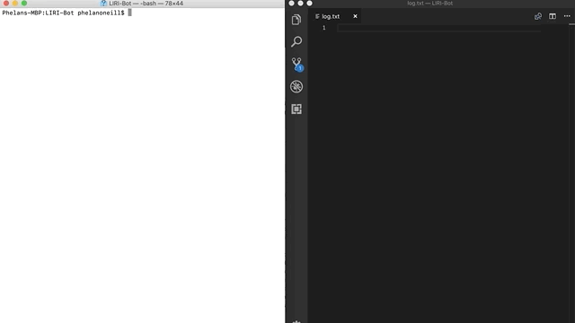

# LIRI-Bot

### Overview

LIRI is like iPhone's SIRI. However, while SIRI is a Speech Interpretation and Recognition Interface, LIRI is a _Language_ Interpretation and Recognition Interface. LIRI is a command line node app that takes in your responses to a series of prompts and gives you data back.

This app uses several node libraries, including inquirer, axios, spotify, moment and the native file system. You'll need to run **npm install** to ensure all dependencies are properly loaded before using the app. 

Run this app from your command line interface via the command **node liri.js** once you've navigated to the relevant folder on your local machine. 



#### Concert-This

Selecting this option will search the Bands in Town Artist Events API for an artist and render the following information about each event to the terminal and to a log file named 'log.txt':

```
* This will search the Bands in Town Artist Events API (`"https://rest.bandsintown.com/artists/" + artist + "/events?app_id=codingbootcamp"`) for an artist and render the following information about each event to the terminal:
* Name of the venue
* Venue location
* Date of the Event 
* If no band is entered, it will default to search for 'Weezer'
```

#### Spotify-this-song

Selecting this option will search the Spotify API for an artist and render the following information about the most relelvant song to the terminal and to a log file named 'log.txt':

```
* Artist(s)
* The song's name
* A preview link of the song from Spotify
* The album that the song is from
* If no song is entered, it will default to search for "The Sign" by Ace of Base

```

#### movie-this

Selecting this option will search the OMDB API for a movie and render the following information about the most relelvant movie to the terminal and to a log file named 'log.txt':

```
* Title of the movie.
* Year the movie came out.
* IMDB Rating of the movie.
* Rotten Tomatoes Rating of the movie.
* Country where the movie was produced.
* Language of the movie.
* Plot of the movie.
* Actors in the movie.
```


#### do-what-it-says

Using the `fs` Node package, LIRI will take the text inside of random.txt and then use it to call one of LIRI's commands. By default, it should run `spotify-this-song` for "I Want it That Way," as follows the text in `random.txt`. But if you change the content of the file, you can change this default. 
